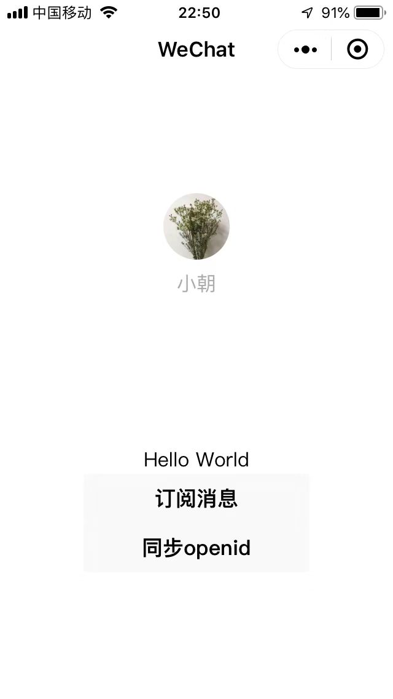
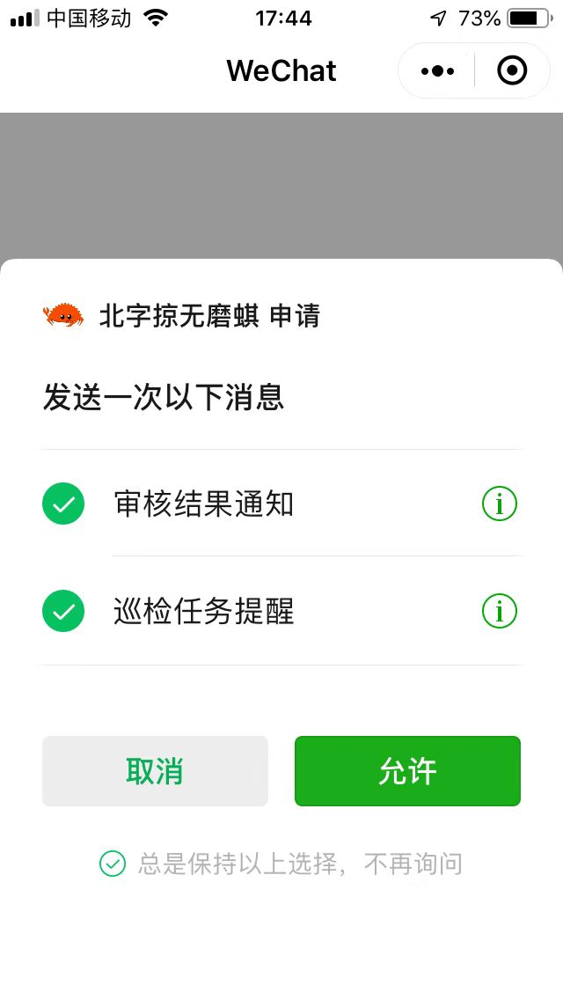
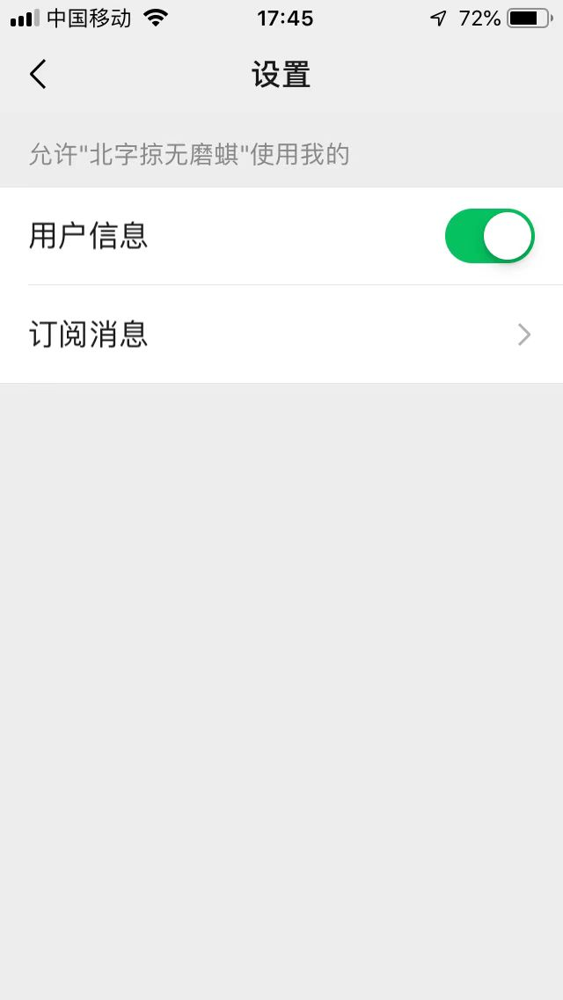
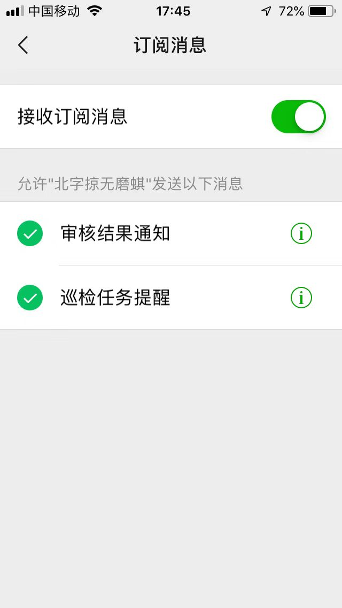
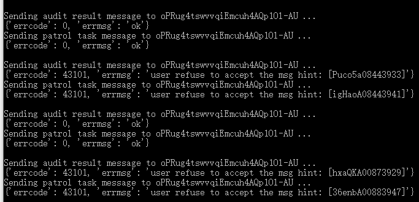
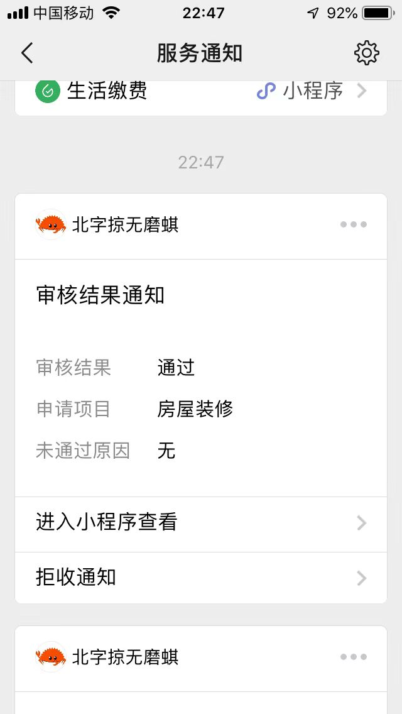
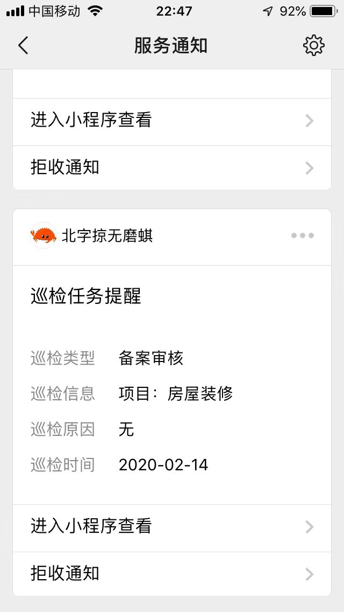

# 微信小程序订阅消息 demo

官方文档：

* [小程序订阅消息](https://developers.weixin.qq.com/miniprogram/dev/framework/open-ability/subscribe-message.html)

注意：

* 同一个微信用户在不同的微信小程序里的 openid 是不一样的。
* 某些官方接口有坑，比如服务端接口 [auth.code2Session](https://developers.weixin.qq.com/miniprogram/dev/api-backend/open-api/login/auth.code2Session.html) 在返回错误响应的时候响应头部 `Content-Type` 为 `text/plain` 而不是 JSON 的 `application/json` 或 `application/javascript` ，这导致了对 aiohttp 的 ClientResponse 实例直接使用其 json() 方法将抛出异常。
* 这里测试的是一次性消息，每订阅一次可以发送一次。

截图：

小程序：

请求订阅消息（一次性消息）：

小程序设置：

小程序设置中的订阅消息：

服务端的调试输出：

收到消息一：

收到消息二：

